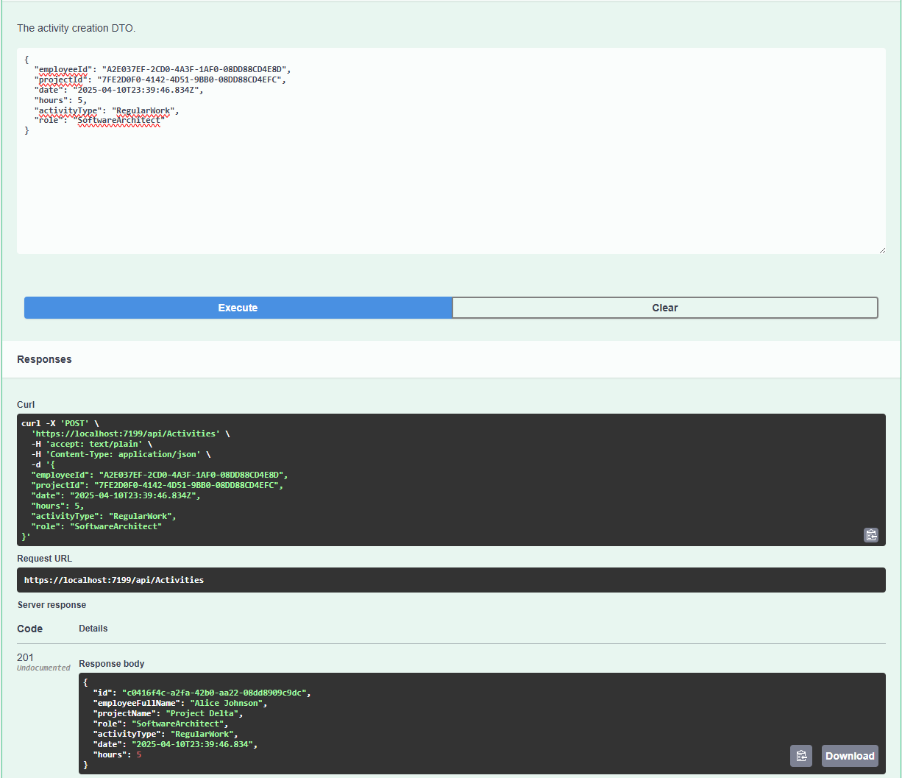
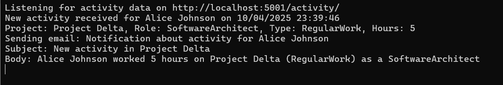

# ⏱️ Time Tracking App

A modular time tracking system for managing **activities**, **projects**, and **personal time logs** with clear API endpoints and inter-service communication.

---

## 📦 Tech Stack

- **Backend:** ASP.NET Core Web API
- **Mediator Pattern:** [MediatR](https://github.com/jbogard/MediatR)
  **CQRS (Command Query Responsibility Segregation) pattern**
- **HTTP Communication:** `HttpClient`
- **Serialization:** Newtonsoft.Json
- **Project Management & Activities:** Modular controller design

```
[API Controller]
       |
       v
[Mediator]
   |         |
[Query]   [Command]
   |         |
[Read DB] [Write DB]
```

---

## 🚀 Setup Instructions

1. **Clone the repository**:

   ```bash
   git clone https://github.com/your-org/time-tracking-app.git
   cd time-tracking-app
   ```

2. **Restore dependencies**:

   ```bash
   dotnet restore
   ```

3. **Run the project**:

   ```bash
   dotnet run --project TimeTracking.API
   ```

4. Ensure you have the **client service** running on:

   ```
   http://localhost:5001
   ```

## 🧠 Design Overview

### 🗂 Project Structure

```
/TimeTracking.API
│
├── Controllers
│   ├── ActivitiesController.cs
│   └── ProjectsController.cs
│
├── Application
│   ├── Activities
│   ├── Projects
│   └── DTOs
```

### 🏗 Architecture Decisions

- **MediatR** is used to implement **CQRS** — separating command and query responsibilities in handlers.
- **HttpClient** is used in `ActivitiesController` to forward data to a **client service** after creation.
- **Loose coupling**: Controller logic delegates business rules to handlers via `IMediator`, improving testability.
- **DTOs**: Used for abstraction between transport and domain models.

---

## 🔄 Inter-App Collaboration

### 📩 Notification Example

After an activity is created via `POST /api/activities`, the app sends a notification (or forwards the activity) to an external client:

```bash
POST http://localhost:5001/activity
Content-Type: application/json

{
  "id": "82e5f...",
  "title": "Project Beta",
  ...
}
```

## 📸 Screenshots

| Activity Created in Swagger           | Logs on Client Side            |
| ------------------------------------- | ------------------------------ |
|  |  |

---

## 📮 API Overview

### `POST /api/activities`

Create a new activity and notify a client.

### `GET /api/activities/{id}`

Get an activity by ID.

### `GET /api/projects`

Retrieve all projects.

### `POST /api/projects`

Create a new project.

> Full Swagger documentation available at `/swagger/index.html` when the app is running.

---

## ✅ TODOs / Nice to Have

- [ ] Replace `HttpClient` with message queue (e.g., RabbitMQ, Kafka)
- [ ] Add authentication/authorization
- [ ] Add automated integration tests
- [ ] Add Docker support for client app
